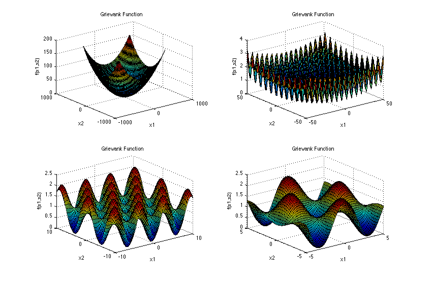
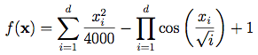
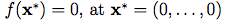

# Griewank-Function


## Función Griewank


## Descripción:
*Dimensiones*: d

La función Griewank tiene muchos mínimos locales generalizados, que se distribuyen regularmente. La complejidad se muestra en los gráficos ampliados.

## Dominio de entrada:
La función se evalúa normalmente en el hipercubo xi ∈ [-600, 600], para todo i = 1, ..., d.

## Minimo Global:


Como se puede observar en la imagen, el mínimo global de la función Griewank se encuentra en el punto (0,0,0,...,0) con un valor de 0. Es decir, si tenemos `1` dimensión, el mínimo global es `0` en el punto `(0)`, si tenemos 2 dimensiones, el mínimo global es `0` en el punto `(0,0)`, y así sucesivamente.

## Codigo:

```Python
def f(x: list[float]) -> float:
    """Cost function of the Griewank function.

    Parameters
    ----------
    x : list[float]
        List of the n decision variables to evaluate.

    Returns
    -------
    float
        The cost of the function evaluated in the given point(s).
    """

    # Get the N value
    n = len(x)

    return (
        1
        + sum([x[i] ** 2 / 4000 for i in range(n)])
        - np.prod([np.cos(x[i] / np.sqrt(i + 1)) for i in range(n)])
    )

```

# Contribuciones 
- Uribe Matus Miguel Angel

- Lopez Ituarte Austin

## 2024
- Axel Isaac García González

- Margarita Elorza Velásquez
